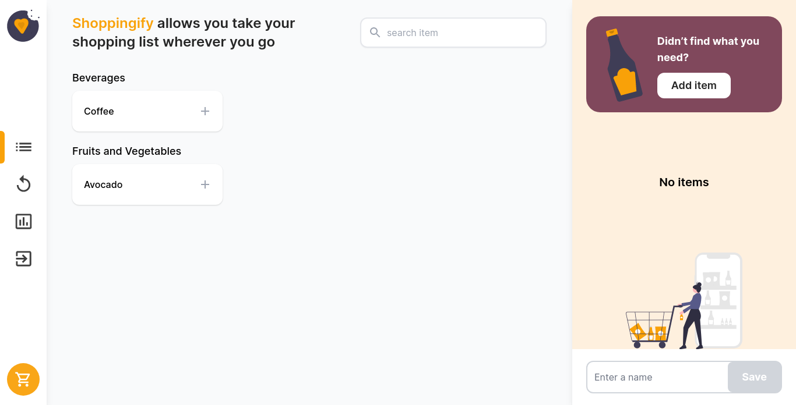
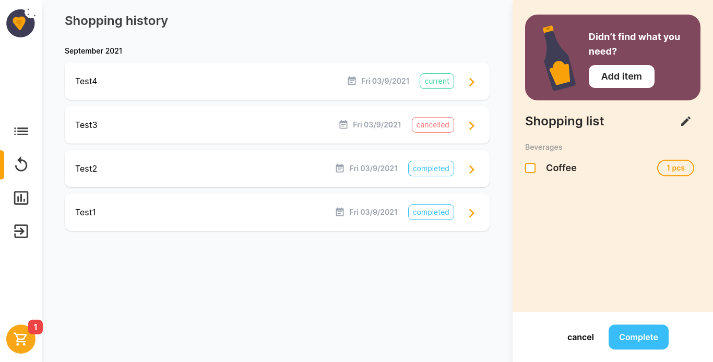
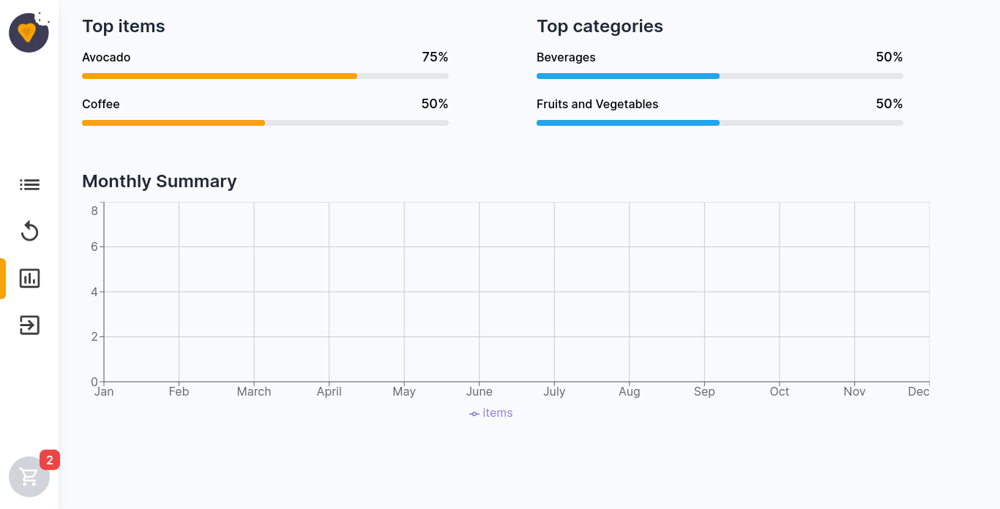

<!-- Please update value in the {}  -->

<h1 align="center">Shoppingify</h1>

<div align="center">
   Solution for a challenge from  <a href="http://devchallenges.io" target="_blank">Devchallenges.io</a>.
</div>

<div align="center">
  <h3>
    <a href="https://shoppingify-app.herokuapp.com/">
      Demo
    </a>
    <span> | </span>
    <a href="https://github.com/Hussein-Mourad/shoppingify/">
      Solution
    </a>
    <span> | </span>
    <a href="https://devchallenges.io/challenges/mGd5VpbO4JnzU6I9l96x">
      Challenge
    </a>
  </h3>
</div>

<!-- TABLE OF CONTENTS -->

## Table of Contents

- [Table of Contents](#table-of-contents)
- [Overview](#overview)
  - [Index Page](#index-page)
  - [History Page](#history-page)
  - [Stats Page](#stats-page)
  - [Built With](#built-with)
- [Features](#features)
- [How To Use](#how-to-use)
- [Contact](#contact)

<!-- OVERVIEW -->

## Overview

### Index Page


### History Page 


### Stats Page


### Built With


- [React](https://reactjs.org/)
- [Node.js](https://nodejs.org/)
- [Tailwind](https://tailwindcss.com/)

## Features

- User can make shopping lists.
- User can add items to his shoppging list.
- User can set a name to his shopping list.
- User can edit shopping list name.
- User can add a new product it not found.
- User can add/reduce quanitiy of items he want to buy.
- User can check item as done.
- User can set shopping list as completed.
- User can set shopping list as cancelled.
- User can see the history of all shopping lists and the items in it.
- User can see statistics to the products he buy most and from what categories.

This application/site was created as a submission to a [DevChallenges](https://devchallenges.io/challenges) challenge. The [challenge](https://devchallenges.io/challenges/mGd5VpbO4JnzU6I9l96x) was to build an application to complete the given user stories.

## How To Use

<!-- Example: -->

To clone and run this application, you'll need [Git](https://git-scm.com) and [Node.js](https://nodejs.org/en/download/) (which comes with [npm](http://npmjs.com)) installed on your computer. From your command line:

```bash
# Clone this repository
$ git clone https://github.com/Hussein-Mourad/shoppingify.git

# Install dependencies
$ npm install

# Run the app
$ npm start
```

## Contact

- Website [hussein.ninja](https://hussein.ninja)
- GitHub [Hussein-Mourad](https://github.com/Hussein-Mourad)
- Twitter [HusseinMourad0](https://twitter.com/HusseinMourad0)
